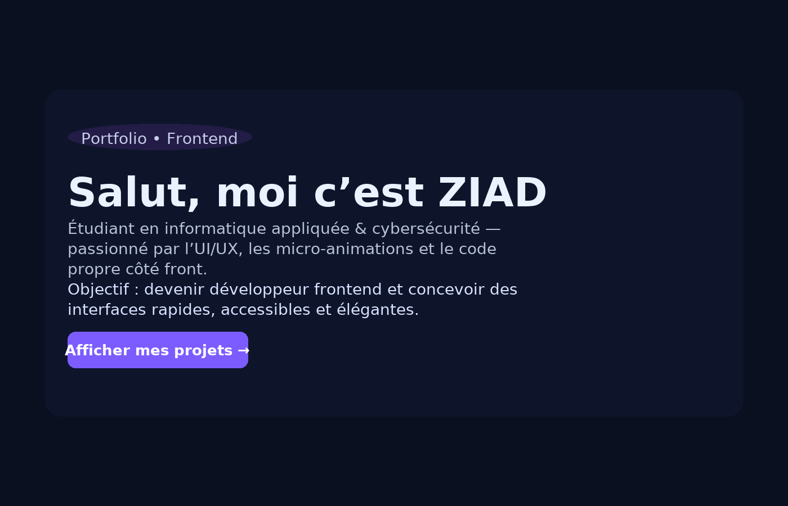

# Page d’introduction personnelle — ZIAD

## 📌 Description
Cette page est une **landing page en une seule section** réalisée avec l’aide d’outils d’IA (Lovable) puis **personnalisée manuellement** dans un éditeur (Cursor).

Elle présente :
- Mon **nom** et rôle
- Un **sous-titre** décrivant mon profil
- Un **bouton CTA** “Afficher mes projets”
- Un **thème sombre personnalisé** avec halo violet/bleu
- Une **mise en page centrée** et responsive

## 🎯 Objectif
Créer une page de présentation rapide et visuellement attrayante pour mon profil de **développeur frontend**, en combinant design, accessibilité et performance.

## 🛠️ Technologies utilisées
- **HTML5** — structure et contenu
- **CSS3** — mise en forme, couleurs, animations légères
- **Google Fonts** — `Inter` et `JetBrains Mono`
- **Lovable AI** — génération initiale de la structure
- **Personnalisation manuelle** — ajustements de police, espacement, couleurs, accessibilité

## 📂 Fichiers fournis
- `ziad_page_introduction.html` → Page complète prête à être ouverte dans un navigateur.
- `capture_ziad_page.png` → Capture d’écran/aperçu du rendu final.

## 🚀 Utilisation
1. Télécharger `ziad_page_introduction.html`
2. L’ouvrir dans votre navigateur
3. (Optionnel) Modifier le texte, les couleurs ou les styles dans un éditeur de code comme **VS Code** ou **Cursor**.

## ✨ Améliorations manuelles ajoutées
- Changement des **polices** (`Inter` + `JetBrains Mono`)
- **Letter-spacing** et **line-height** optimisés
- Effet de **hover** et ombre dynamique sur le bouton
- **Styles d’accessibilité** (`focus-visible`, réduction des animations si activée)

## 📸 Aperçu

